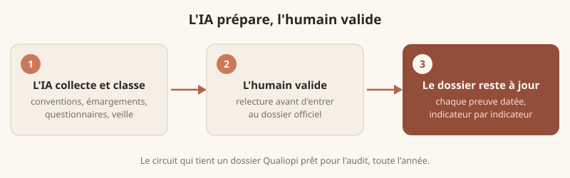

Peut-on automatiser la conformité Qualiopi avec l'intelligence artificielle ? **En grande
partie, oui, mais pas tout.** La certification repose sur la preuve et la traçabilité :
l'IA excelle à collecter, classer et mettre en forme ces preuves, pendant qu'un humain
garde la responsabilité de la validation. Bien menée, cette approche rend plusieurs heures
par semaine et change la façon d'aborder l'audit.

Vous connaissez la scène : l'audit de surveillance approche, et les preuves existent
toutes, mais partout sauf au même endroit (le drive, les boîtes mail, les classeurs de
trois personnes). Voici ce qui s'automatise, ce qui ne doit surtout pas l'être, et par où
commencer.

Cet article fait partie de notre guide plus large sur
[intégrer l'IA dans votre organisme de formation](/blog/integrer-ia-organisme-formation/).

## Ce que Qualiopi exige vraiment : des preuves, toute l'année

Le Référentiel National Qualité comporte 7 critères et 32 indicateurs. Il ne demande pas
seulement de bien faire : il demande de **prouver** que vous le faites, indicateur par
indicateur, en continu. Voici les preuves attendues, critère par critère :

| # | Le critère, en clair | Preuves typiques |
|---|---|---|
| 1 | Informer le public : offre, délais, résultats | Catalogue et pages web à jour, taux de satisfaction et de réussite publiés |
| 2 | Fixer des objectifs précis aux prestations | Programmes, objectifs évaluables, positionnement à l'entrée |
| 3 | Adapter les parcours aux bénéficiaires | Convocations, émargements, évaluations, livret d'accueil |
| 4 | Mettre les moyens en face | Supports, plannings, CV et conventions des intervenants |
| 5 | Qualifier ses équipes | CV, plan de développement des compétences, entretiens |
| 6 | S'inscrire dans son environnement professionnel | Comptes rendus de veille légale, sectorielle et handicap |
| 7 | Recueillir les appréciations et réclamations | Questionnaires, registre des réclamations, actions d'amélioration |

Source : Référentiel national qualité (arrêté du 6 juin 2019),
[travail-emploi.gouv.fr](https://travail-emploi.gouv.fr/qualiopi-marque-de-certification-qualite-des-prestataires-de-formation).

À cette collecte s'ajoutent les chantiers voisins qui alimentent le dossier ou en
dépendent : le [BPF](/blog/remplir-bpf-organisme-formation/) et sa consolidation annuelle,
les attestations, les dossiers de financement (CPF, OPCO). Chez les organismes que nous
accompagnons, cette charge représente couramment 8 à 15 heures par mois, dispersées,
répétitives, et concentrées au pire moment : juste avant l'audit.

Bonne nouvelle : les critères 1, 3, 6 et 7 reposent presque entièrement sur une collecte
continue et répétitive. C'est exactement ce que l'automatisation absorbe le mieux.

## La règle d'or : l'IA prépare, l'humain valide

**Ce qui s'automatise bien :**

- **La centralisation des preuves** : l'IA surveille vos espaces de stockage (Drive, SharePoint, Dropbox), détecte chaque nouveau document, le nomme, le classe et le rattache au bon indicateur.
- **La mise en forme** : comptes rendus, tableaux de suivi et synthèses prêts à présenter.
- **Les rappels** : alertes avant échéance pour qu'aucun indicateur ne « se vide » de ses preuves.
- **Les questionnaires** : envoi à chaud et à froid, relance des non-répondants, compilation mensuelle.
- **La veille** : résumés réguliers des évolutions réglementaires qui vous concernent.

**Ce qui doit rester humain :** décider de ce qui constitue une preuve valable, relire
tout document avant son entrée au dossier, et tenir la relation avec l'auditeur. Un
auditeur cherche des preuves cohérentes et sincères, pas un volume de documents générés à
la chaîne.

## 5 automatisations concrètes, jusqu'à 5 heures rendues par semaine

Voici les chantiers qui produisent le gain le plus net, dans l'ordre où il est souvent
judicieux de les traiter :

1. **Les relances d'émargement** (1 h à 1 h 30 par semaine). Un workflow détecte les émargements manquants à J+1, relance, escalade sous 48 h sans réponse, et classe les retours au bon endroit. Notre guide sur [la feuille d'émargement et son automatisation](/blog/feuille-emargement/) détaille cette mise en place.
2. **Les questionnaires de satisfaction** (1 h à 2 h par semaine). Envoi au bon moment, relance automatique, rapport synthétique mensuel : vous lisez le rapport, vous ne remplissez plus de tableurs.
3. **Les comptes rendus de réunion** (30 min à 1 h par semaine). L'IA transcrit, structure et rédige à partir d'un enregistrement ou de notes brèves ; vous validez en quelques minutes.
4. **Les conventions de formation** (30 min à 1 h par semaine). Un outil branché sur votre CRM génère les [conventions de formation](/blog/convention-de-formation/), les envoie en signature électronique et les archive, sans saisie manuelle.
5. **La veille réglementaire** (30 min à 1 h par semaine). Un agent IA surveille les sources officielles (DREETS, France Compétences, OPCO) et vous envoie un briefing régulier : un critère souvent sous-estimé, rarement optionnel.

Ces estimations viennent d'organisations comparables à la vôtre, pas d'une moyenne
théorique : elles servent à prioriser, pas à promettre.

## Testé chez nous avant d'être proposé chez vous

Avant de déployer ces automatisations chez des organismes clients, Julien Rayes, fondateur
de Claude Agency, les a d'abord mises en place dans son propre organisme de formation,
plus de 3 M€ de chiffre d'affaires :

> « Les relances administratives me prenaient 2 h par jour. Après automatisation : 2 h par
> mois. Les comptes rendus de visio : 2 à 3 h par semaine. Après automatisation : 2 à 3 h
> par mois. »

Pour un organisme de 5 à 15 personnes, l'administratif représente couramment 20 à 30 % du
temps de travail. Ce temps rendu retourne à la pédagogie et au développement commercial,
pendant que la mécanique tourne en arrière-plan.

  
Et si votre dossier Qualiopi se tenait à jour tout seul ?

  
Audit offert, sans engagement : on identifie ensemble les 3 automatisations qui vous rendraient le plus de temps, et vous repartez avec une feuille de route écrite et chiffrée, que vous nous confiiez la suite ou non.

  <a href="/contact/" class="mt-6 inline-block rounded-lg bg-cream-50 px-6 py-3 font-medium text-brand-700 hover:bg-cream-100">Réserver mon audit offert</a>

## L'audit de surveillance, sans la semaine blanche

L'audit de surveillance est le moment où l'éparpillement des preuves coûte le plus cher ;
nous lui consacrons un [guide dédié](/blog/qualiopi-guide-organisme-formation/). Une
automatisation bien réglée **pré-remplit votre dossier d'audit** : chaque indicateur
arrive avec ses preuves déjà rassemblées, datées et mises en forme. Vous ne reconstituez
plus l'historique pendant des journées, vous relisez, vous ajustez, vous validez.

C'est précisément ce que couvre notre service
d'[automatisation des process](/services/automatisation/) : en 4 à 6 semaines, la plupart
de nos clients ont un dossier qui se tient à jour en continu, sans rattrapage de dernière
minute.

## Par où commencer concrètement

1. **Cartographier** les indicateurs où la collecte de preuves vous coûte le plus de temps.
2. **Choisir un seul chantier** et l'automatiser de bout en bout, pas dix à moitié faits.
3. **Tester** sur un cycle réel et mesurer le temps gagné.
4. **Étendre** progressivement aux autres indicateurs une fois la mécanique fiabilisée.

Si vous ne savez pas par quel indicateur démarrer, c'est l'objet d'un
[audit & diagnostic IA](/services/audit-ia/) : on identifie ensemble les automatisations
à plus fort retour.

## Les erreurs à éviter

- **Confondre volume et preuve** : empiler des documents générés n'impressionne pas un auditeur, au contraire. La cohérence et la sincérité comptent plus que la quantité.
- **Automatiser sans relire** : une erreur recopiée à grande échelle est pire qu'une tâche manuelle. Un circuit de validation systématique s'impose avant toute entrée au dossier officiel.
- **Tout vouloir d'un coup** : un indicateur fiabilisé vaut mieux que dix chantiers à moitié faits.
- **Oublier la traçabilité des dates** : l'historique daté est souvent ce que l'auditeur regarde en premier. Chaque document doit porter une date claire et vérifiable.

## Questions fréquentes

**L'IA est-elle compatible avec une certification Qualiopi ?**
Oui. Rien n'interdit d'utiliser l'automatisation pour préparer vos preuves, tant que vous
gardez une validation humaine et une traçabilité claire. Bien utilisée, elle **renforce**
la conformité en évitant les oublis et les preuves manquantes.

**Quels indicateurs gagne-t-on le plus à automatiser ?**
Ceux qui reposent sur une collecte continue et répétitive : satisfaction,
[feuille d'émargement](/blog/feuille-emargement/), suivi des réclamations, veille. Pour le
détail du référentiel, voir [les indicateurs Qualiopi](/blog/indicateurs-qualiopi/).

**Combien de temps peut-on espérer gagner ?**
Cela dépend de votre organisation, mais le gain le plus net se joue sur la préparation de
l'audit de surveillance. À l'échelle d'une année, plusieurs semaines de travail peuvent
être récupérées sur l'ensemble des tâches liées à la preuve.

Pour savoir ce qui est automatisable chez vous, commencez par un
[audit offert](/contact/) : vous repartez avec une feuille de route claire et chiffrée.

## Pour aller plus loin

- **[Guide Qualiopi complet pour les organismes de formation](/blog/qualiopi-guide-organisme-formation/)** : comprendre le référentiel avant de l'automatiser.
- **[Les indicateurs Qualiopi expliqués](/blog/indicateurs-qualiopi/)** : identifier ce qu'on peut automatiser, indicateur par indicateur.
- **[ROI de l'IA dans un organisme de formation](/blog/roi-ia-organisme-formation/)** : chiffrer le gain de temps.
- **[Make pour organisme de formation](/blog/make-automatisation-organisme-formation/)** : l'outil des premiers scénarios d'automatisation.
- **[Quel logiciel pour un organisme de formation](/blog/logiciel-organisme-formation/)** : bien choisir ses outils avant d'automatiser.
